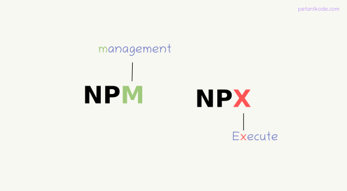

# Sesión 02 - Fundamentos de React

🎯 **Objetivos:**

+ Entender la diferencia entre HTML y JSX.
+ Ver y aprender cómo react permite la reutilización de componentes.
+ Maneras de insertar CSS a proyectos con react.

<!-- ### Secciones:

## 🛠 Prework

**Objetivos:**

+ Saber como vivíamos antes de React.js
+ Saber que es react
+ Conocer es MVC

**¿Qué es react?**

React también llamada ReactJS es una librería de JavaScript creada por Facebook y publicada como OpenSource, que se diseñó para ayudarnos a desarrollar aplicaciones SPA (Single Page Applications)...[`leer mas`](Prework) -->

### HTML

  

HTML (HyperText Markup Language) es un lenguaje de marcación que sirve para definir el contenido de las páginas web. Se compone en base a etiquetas, también llamadas marcas o tags, con las cuales conseguimos expresar las partes de un sitio web, head, body, header, párrafos, títulos, tablas, listas, etc.

HTML no es un lenguaje de programación, es un lenguaje de marcado que interpreta el navegador web para mostrar los sitios o aplicaciones web tal y como estamos acostumbrados.

---

### JSX

  

JSX es una extensión de la sintaxis de JavaScript para describir cómo debería ser la interfaz de un sitio web. JSX puede recordarte a un lenguaje de marcado como HTML, pero viene con todo el poder de JavaScript. Puede pensarse como un híbrido entre HTML y JavaScript, es especialmente utilizado con ReactJS.

React acepta el hecho de que la lógica de renderizado está intrínsecamente unida a la lógica de la interfaz de usuario: cómo se manejan los eventos, cómo cambia el estado con el tiempo y cómo se preparan los datos para su visualización.

En lugar de separar artificialmente tecnologías poniendo el maquetado y la lógica en archivos separados, React separa intereses con unidades ligeramente acopladas llamadas “componentes” que contienen ambas.

Es muy importante entender la diferencia entre HTML y JSX, HTML es solo un lenguaje de marcado para estructurar elementos, no define la  lógica de las aplicaciones mientras que JSX es un lenguaje de programación (basado en JavaScript) que contiene etiquetas para definir la estructura de un sitio.

--- 

### npx

  

En la sesión pasada repasamos la importancia de `npm` y vimos que es un excelente gestor de paquetes para Node.js, nos permite instalar y controlar los paquetes de una forma segura y sobre todo muy sencilla. Sin embargo cuando se trata de ejecutar estos paquetes no hay mucho que `npm` pueda hacer, al menos no de una forma sencilla. De esta necesidad nace `npx`. 

`npx` <b>no</b> es un gestor de paquetes, es un ejecutor de paquetes. La ventaja de usar `npx` es que por atrás hará la misma instalación usando `npm` pero una vez instalado el paquete estará listo para ejecutarse. A partir de la versión 5.0.6 de node.js ya se incluye `npx` en la instalación.

Otra maravilla de `npx` es que es capaz de generar un exqueleto de proyecto en ReactJS previamente configurado y listo para ser ejecutado, todo esto con el simple comando `npx create-react-app <nombre-proyecto>`.

--- 

### ReactJS 

  

React es una biblioteca de Javascript especializada en el desarrollo de interfaces de usuario. Sin embargo, lo cierto es que en React encontramos un excelente aliado para hacer todo tipo de aplicaciones web, SPA (Single Page Application) o incluso aplicaciones para móviles. Para ello, alrededor de React existe un completo ecosistema de módulos, herramientas y componentes capaces de ayudar al desarrollador a cubrir objetivos avanzados con relativamente poco esfuerzo.

Sirve para desarrollar aplicaciones web de una manera más ordenada y con menos código que si usas Javascript puro o bibliotecas como jQuery centradas en la manipulación del DOM. Permite que las vistas se asocien con los datos, de modo que si cambian los datos, también cambian las vistas.

En comparación con otras bibliotecas o frameworks React nos permite una arquitectura de desarrollo más avanzada, con diversos beneficios como la encapsulación del código en componentes, que nos ofrecen una serie de ventajas, como la posibilidad de que esos componentes conversen e interaccionen entre si, algo que que sería muy difícil de conseguir de otra forma. Esta arquitectura es conocida como orientada a componentes y su filosofía principal es modularizar el contenido de la aplicación.

+ [`Ejemplo 01: Techo del cielo`](Ejemplo-01/Readme.md)
+ [`Reto 01: ¡A comer!`](Reto-01/Readme.md)

Otra de las principales ventajas de React es que nos permite reutilizar componentes para evitar la repetición de código y mejorar la eficiencia de la aplicación. Las definiciones de los componentes se pueden ver como un molde con el cual es posible construir tantas instancias de este como se necesiten. 

+ [`Ejemplo 02: Luz Mercurial`](Ejemplo-02/Readme.md)
+ [`Reto 02: ¡Yo me lo llevo!`](Reto-02/Readme.md)

---

<!-- ## 🕵 Ejemplos:

+ [`Ejemplo 01: Techo del cielo`](Ejemplo-01/Readme.md)
+ [`Ejemplo 02: Luz Mercurial`](Ejemplo-02/Readme.md)

## 💻 Retos:

+ [`Reto 01: ¡A comer!`](Reto-01/Readme.md)
+ [`Reto 02: ¡Yo me lo llevo!`](Reto-02/Readme.md)
 -->
<!-- ## 🛡 Postwork

**Mejorando nuestra Luz Mercurial**...[`leer más`](Postwork/)

## ⚛ ORGANIZACION DE LA CLASE
+ Qué es React
+ create-react-app
+ Qué es JSX
+ Buenas prácticas para comenzar un proyecto
+ Creando componentes
+ Insertando CSS global
+ Insertando CSS por componente
+ Reutilización de componentes -->

### 🎩 [Buenas prácticas para empezar un proyecto](../BuenasPracticas/EmpezandoProyectos/Readme.md).
