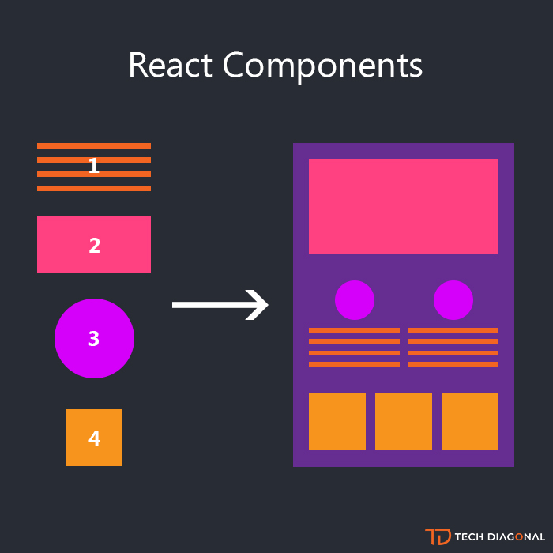
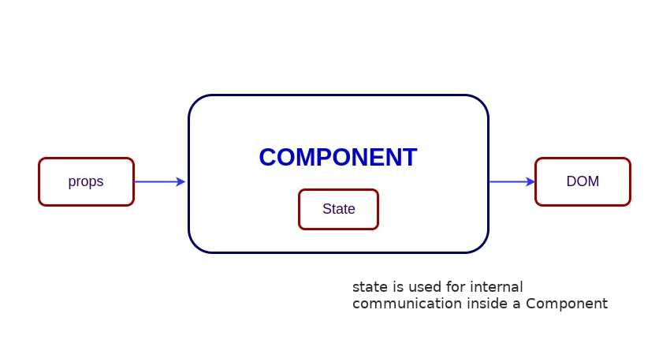

## Sesión 03: Estado (state) y Propiedades (props)

🎯 **Objetivos:**

+ Introducción de **componentes stateful **.
+ Entender la diferencia entre **componentes stateless** y **stateful**.
+ Cómo **declarar** y usar el estado en **componente stateful**.
+ Cómo **declarar**, **mandar** y usar **valores** para usarse como **propiedades**.
<!-- + Entender el **virtual DOM**. -->

<!-- ### Secciones:

## 🛠 Prework

**Objetivos:**

+ Saber que son las **Props (Propiedades)**
+ Conocer que es el **Estado (State)**
+ Saber que es **this.state**

**¿Qué son las Props (Propiedades)?**

Las propiedades son la manera que tienen los componentes de React de comunicarse entre sí...[`leer mas`](Prework)
 -->

### Componentes

 

Aunque hay muchos conceptos importantes a cubrir, los componentes son sin lugar a dudas el corazón y el alma de React. Es importante entender el concepto y las clasificaciones de los componentes para poder desarrollar aplicaciones en React de forma adecuada.

Los componentes son autosostenibles, micro-entidades independientes que describen una parte de la interfaz de usuario, donde cada componente tiene su propio código, estructura y API.

Facebook, por ejemplo, tiene miles de piezas de funcionalidad entretela juntos al ver su aplicación web. Aquí es un hecho interesante: Facebook consta de 30.000 componentes, y el número está creciendo. La arquitectura de componentes le permite pensar en cada pieza por separado. Cada componente puede actualizar todo su alcance sin estar preocupado por cómo afecta a otros componentes.

Como se vio en la sesión anterior los componentes también son reutilizables. Si se necesita el mismo componente en varios lugares con la ayuda de sintaxis JSX, se pueden declarar los componentes donde sea necesario que aparezcan, y eso es todo.

---

## Props y State

Los componentes necesitan datos para trabajar. Existen dos maneras diferentes en que se pueden transmitir datos entre los componentes: <b>Props</b> y <b>State</b>. Éstos determinan qué muestra un componente y cómo se comporta.

### Props

 

Si vemos los componentes como funciones de JavaScript, entonces los <b>props</b> sería la entrada de la función. Por esa analogía, un componente acepta una entrada, procesa y luego genera una salida, esta salida es lo que se debe mostrar en la interfaz de usuario de la aplicación (este proceso es conocido como render).

La información que almacenan los <b>props</b> está disponible en todo el componente, sin embargo, la filosofía de React es que estos deben ser inmutables y *top-down*, esto quiere decir que el componente padre puede pasar tanta información como sea necesaria a sus componentes hijos por medio de <b>props</b> pero el hijo no puede modificarlos. 

<b>Todos los componentes de React deben actuar como funciones puras con respecto a sus props.</b>

Por supuesto, las interfaces de usuario de las aplicaciones son dinámicas y cambian con el tiempo. Por lo que es necesario permitir a los componentes de React cambiar su salida a lo largo del tiempo en respuesta a acciones del usuario, respuestas de red y cualquier otra cosa, sin violar esta regla. Esto se logra con el concepto de Estado.

 --- 

### State

 

Por otro lado, el estado es un objeto que almacena el valor de las variables en las cuales se guarda la información necesaria para el funcionamiento del componente. Este objeto es propiedad del componente en el cual fue declarado y su alcance esta limitado al componente al que pertenece, es decir, no se pude usar fuera de él.

Cada componente puede inicializar su estado y modificarlo en cualquier momento que sea necesario. Usualmente el estado del componente padre termina siendo un <b>prop</b> del componente hijo. Cuando transmitimos el estado a otro componente se convierte en un <b>prop</b>

---

## Clasificación de componentes

Los componentes en React pueden clasificarse respecto a dos atributos importantes: 

- La forma en la que son definidos (Clases o funcionales)
- Su estado (Stateful y Stateless)

### Componentes de Clase vs Componentes funcionales

La primera clasificación corresponde a que mecanismo de JavaScript se utiliza para definir los componentes

#### Componentes funcionales

Los componentes funcionales están definidos como funciones de JavaScript, toman una entrada que como dijimos anteriormente es el <b>prop</b>. Estos componentes son como los hemos estado definiendo hasta ahora.

#### Componentes de Clase

Los componentes de clase son definidos como clases de JavaScript, ofrecen mas funcionalidades, pero con mas funcionalidades vienen mas responsabilidades. La principal ventaja de los componentes de clase sobre los funcionales es que los primeros tienen estado aunque podrian definirse componentes de clase que no tengan estado.

Para poder crear un componente de clase se define como una clase y esta extiende de `React.Component`. Se define un método constructor que recibe <b>props</b> como entrada y dentro de este siempre se llama a `super()` que se refiere al constructor de la clase padre. Y por último se define el método `render()` para generar la vista del componente, este es el que regresa el contenido a mostrar del componente.

+ [`Ejemplo 01: Patricio`](Ejemplo-01/Readme.md)
+ [`Reto 01: Tía Socorro ganó`](Reto-01/Readme.md)

---

### Stateful vs Stateless

La siguiente clasificación se refiere al uso del estado por parte de cada componente

#### Stateful 

Los componentes *Stateful* son aquellos que tienen estado, siempre se trata de componentes de clase (pues sólo éstos pueden tener estado). El estado es definido en el método constructor, aquí un ejemplo sencillo 

	constructor() {
	    super();
	    this.state = {
	    	count: 1
	    }
  	}

El estado es representado por un objeto y puede modificarse en el momento que sea necesario.

#### Stateless

Son aquellos componentes que no hacen uso del estado. Todos los componentes funcionales son *Stateless* pero también podemos definir componentes de clase que sean de este tipo.

+ [`Ejemplo 02: Gracias Abuelo`](Ejemplo-02/Readme.md)
+ [`Reto 02: Cada quien su mantel`](Reto-02/Readme.md)

---

### ¿Cuándo usar cada componente?

- Los componentes funcionales son recomendados cuando la lógica del componente es simple.
- Si la lógica es mas compleja se recomienda usar componentes de clase.
- Si el estado es indispensable es necesario usar componentes de clase.
- Si se busca transmisión de datos entre componentes sencillos se recomienda el uso de componentes funcionales.
- Los componentes funcionales tienen un rendereo más rápido en la mayoría de los casos.

<!-- ## 🛡 Postwork

**Mejorando el reto cada quien su mantel**...[`leer más`](Postwork/)

## ⚛  ORGANIZACION DE LA CLASE 
+ Componentes stateless (funcionales) VS stateful (clase).
+ Conversión de stateless a stateful y viceversa.
+ Cuándo y porqué usar cada componente.
+ Declaración y utilización de estado (state).
+ Declaración y utilización de propiedades (props) en los 2 tipos de componente
+ Buenas prácticas de propiedades (librería prop-types). -->

### 🎩 [Buenas prácticas para las propiedades (props)](../BuenasPracticas/PropTypes/Readme.md).
