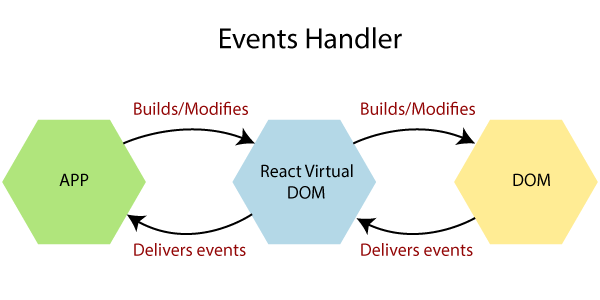
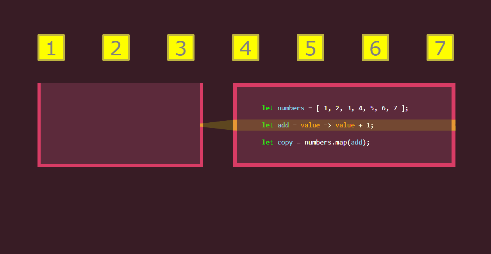

# Sesión 04: Ciclo de vida, setState, eventos y .map()

🎯 **Objetivos:**

- Introducción de los **ciclos de vida:** **DidMount**, **WillUnmount**, **DidUpdate**.
- Entender en que momento se ejecuta cada uno.
- Como **modificar** el **estado**.
- Ver todos los eventos disponibles: **change**, **click**, **hover**, etc.
- Aprender a usar los eventos **onClick** y **onChange**.
- Mandar funciones como **props**.

<!-- ### Secciones:

## 🛠 Prework

**Objetivos:**

- Conocer el Ciclo de vida de los componentes 

**Ciclo de vida de los componentes**

Se llama ciclo de vida al tiempo que pasa desde que un objeto se crea desde el código hasta que se elimina...[`leer mas`](Prework) -->

## Eventos del navegador 
 

Los eventos del navegador son la respuesta del usuario sobre la interfaz gráfica, es la interacción esperada entre el usuario y nuestro producto. La aplicación web debe de estar debidamente preparada para reaccionar a estos eventos. La programación web es descrita como orientada a eventos, pues estos eventos son los que desatan las diferentes acciones programadas para nuestra aplicación. 

JavaScript tiene un mecanismo llamado *HTML DOM events* que nos permite asociar acciones o *handlers* (en forma de funciones) a estos eventos, son un grupo de propiedades ofrecidas por los elementos del DOM para ayudar a manejar cómo los elementos reaccionan a los eventos. Y de esta forma poder generar vistas dinámicas e interactivas para nuestro sitio web.

Una práctica muy importante cuando se está tratando con eventos es mantener al usuario al tanto de lo que está sucediendo en la aplicación, ya sea con una respuesta rápida o instantánea, o algún elemento que le sugiera que el *handler* se está ejecutando.

Manejar correctamente los eventos, así como los posibles errores que estos pudieran generar, es de suma importancia para mejorar la experiencia de usuario y el correcto funcionamiento de nuestra aplicación web.

Hay una gran cantidad de eventos que se pudieran generar en la interacción con un usuario, éstos se pueden consultar en la siguiente <a href="https://www.w3schools.com/jsref/dom_obj_event.asp">página</a> y a todos ellos se les puede asignar un *handler*. Los principales eventos en un sitio web son `click` y `change` que definen el presionar y alterar el valor de un elemento respectivamente. Para manejar estos eventos en JavasScript (en particular en React.js) se utilizan los comandos `onClick` y `onChange`.

---

## Modificar el estado

En la mayoría de los casos los *handlers* modifican el estado de los componentes para así lograr los cambios esperados en la interfaz de usuario. Recordemos que React.js tiene un rendereo dinámico, es decir, si se hace un cambio en el estado, este se refleja automáticamente en la interfaz.

Para lograr esto, React.js utiliza `setState()` esta función realizará una fusión superficial entre el nuevo estado que proporcionó y el estado anterior, y activará una nueva representación de su componente. El método `setState` acepta un argumento `updater` que puede ser un objeto con una cantidad de pares clave-valor que deben fusionarse en el estado, o una función que devuelve dicho objeto.

+ [`Ejemplo 01: Incremento`](Ejemplo-01/Readme.md)
+ [`Reto 01: Incremento y decremento`](Reto-01/Readme.md)

---

## Funciones como elementos de primera clase

En un lenguaje de programación los elementos de primera clase son aquellos que pueden almacenarse en estructuras de datos (tales como arreglos u objetos), regresarse como resultado de una función o método y recibirse como argumento. En JavaScript las funciones elementos de primera clase, esto es especialmente útil pues nos permite pasar funciones como argumentos de otras, como lo acabamos de hacer en el *handler* del botón para el evento `onClick` del ejemplo anterior. De esta forma el comportamiento de un componente puede definirse por el padre al crear la instancia y no hacerlo directamente en la definición del componente de forma estática.

---

## Funciones de Orden superior 

Las funciones de orden superior son aquellas que reciben otra función como parámetro o regresan una función como resultado. Estas funciones son muy útiles para manipular la organización o los datos de estructuras de datos.

La mas popular de estas funciones es sin duda la función `map()` que aplica una función (que recibe como parámetro) a todos los elementos de un arreglo.

 

---

## Ciclos de vida
 

El ciclo de vida son una serie de estados por los cuales pasa todo componente a lo largo de su existencia. Esos estados tienen correspondencia en diversos métodos, que nosotros podemos implementar para realizar acciones cuando se van produciendo. El ciclo de vida es el tiempo que pasa desde que un objeto se crea desde el código hasta que se elimina. 

En React.js es fundamental el ciclo de vida, porque hay determinadas acciones que debemos necesariamente realizar en el momento correcto de ese ciclo. Ese es el motivo por el que hay que aprenderse muy bien cuáles son las distintas etapas por las que pasa la ejecución de un componente React.js. No es un tema trivial y tiene diversos matices. Esto es algo específico de los componentes con estado, ya que los componentes sin estado tienen apenas un método que se usará para renderizar el componente y React.js no controlará su ciclo de vida a través de los métodos que veremos a continuación.

Las cuatro etapas del ciclo de vida de un componente de React.js son:

- <b>Inicialización</b>: se produce cuando el componente es incializado por su componente padre.
- <b>Montaje</b>: se produce la primera vez que un componente va a generarse, incluyéndose en el DOM.
- <b>Actualización</b>: se produce cuando el componente ya generado se está modificando.
- <b>Desmontaje</b>: se produce cuando el componente se elimina del DOM.

Para manejar los ciclos de vida React.js nos proporciona una serie de métodos que representan las etapas.

* `componentWillMount()`: Corresponde a la etapa de montaje. Se ejecuta justo antes del primer renderizado del componente. Si dentro de este método se modifica el estado del componente con setState(), el primer renderizado mostrará ya el dato actualizado y sólo se renderizará una vez el componente.

* `componentDidMount()`: Método de montaje, que solo se ejecuta en el lado del cliente. Se produce inmediatamente después del primer renderizado. Una vez se invoca este método ya están disponibles los elementos asociados al componente en el DOM. Si el elemento tiene otros componentes hijo, se tiene certeza que éstos se han inicializado también.

* `componentWillReceiveProps(nextProps)`: Método de actualización que se invoca cuando las propiedades se van a actualizar, aunque no en el primer renderizado del componente, así que no se invocará antes de inicializar las propiedades por primera vez. Tiene como particularidad que recibe el valor futuro del objeto de propiedades que se va a tener.

* `shouldComponentUpdate(nextProps, nextState)`: Es un método de actualización y tiene una particularidad especial con respecto a otros métodos del ciclo de vida, que consiste en que debe devolver un valor boleano. Si devuelve verdadero quiere decir que el componente se debe renderizar de nuevo y si recibe falso quiere decir que el componente no se debe de renderizar de nuevo. Se invocará tanto cuando se producen cambios de propiedades o cambios de estado y es una oportunidad de comprobar si esos cambios deberían producir una actualización en la vista del componente. El motivo de su existencia es la optimización, puesto que el proceso de renderizado tiene un coste y podemos evitarlo si realmente no es necesario de realizar. Este método recibe dos parámetros con el conjunto de propiedades y estado futuro.

* `componentWillUpdate(nextProps, nextState)`: Este método de actualización se invocará justo antes de que el componente vaya a actualizar su vista. Es indicado para tareas de preparación de esa inminente renderización causada por una actualización de propiedades o estado.

* `componentDidUpdate(prevProps, prevState)`: Método de actualización que se ejecuta justamente después de haberse producido la actualización del componente. En este paso los cambios ya están trasladados al DOM del navegador, así que podríamos operar con el DOM para hacer nuevos cambios. Como parámetros en este caso recibes el valor anterior de las propiedades y el estado.

* `componentWillUnmount()`: Este es el único método de desmontado y se ejecuta en el momento que el componente se va a retirar del DOM. Este método es muy importante, porque es el momento en el que se debe realizar una limpieza de cualquier cosa que tuviese el componente y que no deba seguir existiendo cuando se retire de la página. Por ejemplo, temporizadores o manejadores de eventos que se hayan generado sobre partes del navegador que no dependen de este componente.

El único método que corresponde a la etapa de inicialización es el método constructor que definimos cuando se define el componente.

+ [`Ejemplo 02: bienvenida`](Ejemplo-02/Readme.md)
+ [`Reto 02: Ciclos de vida viejos`](Reto-02/Readme.md) 

---

<!-- ## 🛡 Postwork
Completar el Reto-01 y Reto-02...[`leer más`](Postwork/)
 -->
<!-- ## ⚛ ORGANIZACION DE LA CLASE 
- DidMount, WillUnmount, DidUpdate.
- Eventos del navegador.
- onClick y onChange.
- Modificando el estado con this.setState.
- utilizar un arreglo como estado.
- Desplegando arreglos con componentes.
- Mandar funciones como props. -->
