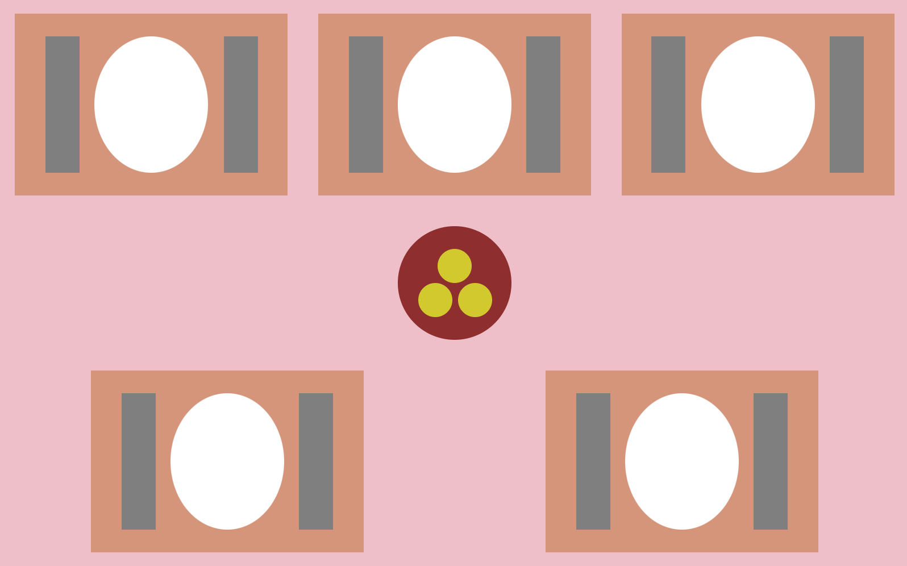

[`React Fundamentals`](../../README.md) > [`Sesión 05: Hooks y useState`](../Readme.md) >[`Ejemplo-02`](../Ejemplo-02) > `Reto 2`

## ¡Pero quiere otro!

### OBJETIVO
- De componente stateful (clase) a hook.

#### REQUISITOS
- Haber completado el [Reto-01](../../Sesion-02/Reto-01) de la Sesion-03.

#### DESARROLLO

1. Abrir nuestro proyecto "Tía Socorro ganó" del [Reto-01](../../Sesion-02/Reto-01) de la Sesion-03.

2. Vamos a convertir nuestro componente `Mantel.js` de stateful (clase) a hooks.

3. Resultado:

[`Anterior`](../Readme.md)
