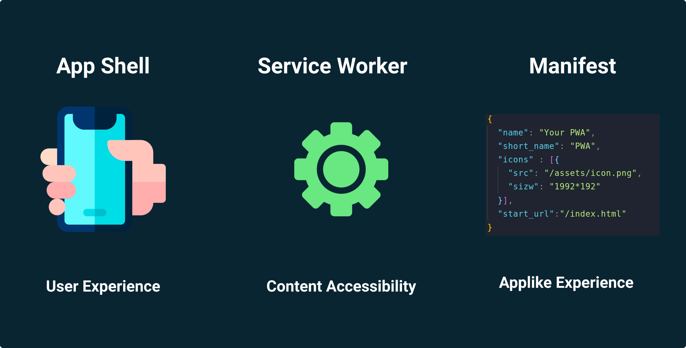
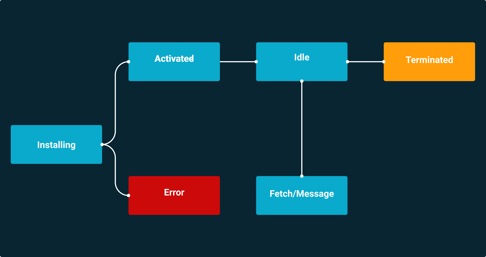
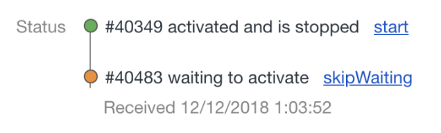

## Sesión 08: Progressive web apps (PWA)

🎯 **Objetivos:**

- Configurar la aplicación react para hacerla progressive web app.
- Configurar un service worker.

<!-- ### Secciones:

## 🛠 Prework

**Objetivos:**

+ Conocer qué es una PWA.

**¿Qué es una PWS?**

PWA o Progressive web apps (aplicaciones web progresivas), es un término que se da a una nueva generación de aplicaciones que incrementan su funcionalidad...[`leer mas`](Prework) -->

## ¿Qué es una aplicación web?

Igual que existen las aplicaciones para Windows, Mac, Android o iOS, también existen otro tipo de aplicaciones que no dependen de ningún sistema operativo, sino que toman lugar en una página web en un navegador.

Las páginas web de Twitter y Facebook son dos buenos ejemplos de aplicaciones web. En ellas puedes hacer prácticamente lo mismo que en las aplicaciones nativas para Android o iOS, pero sin necesidad de instalar nada: solo necesitas un navegador con conexión a Internet.

La definición es suficientemente ambigua para incluir otros ejemplos que no tienen por qué ser tan complejos como las webs de Twitter o Facebook. Por ejemplo, podrían considerarse aplicaciones web un sitio para convertir divisas y otro para consultar el tiempo, aunque habrá quien difiera y opine que son simplemente páginas web sin más.

## ¿Qué es una aplicación nativa?

En términos generales, es una aplicación que ha sido específicamente desarrollada para el sistema operativo en el que corre.

A diferencia de una aplicación web que funciona en distintos sistemas operativos como Windows, Mac o sistemas de móviles, una aplicación nativa ha sido desarrollada específicamente para un sistema operativo y, presumiblemente, respeta mejor el aspecto y funcionamiento en dicha plataforma, además de funcionar más fluida.

## ¿Qué es una aplicación web progresiva (PWA)?

Las aplicaciones web progresivas están a medio camino entre las dos anteriores: son básicamente páginas web, pero mediante el uso de Service Workers y otras tecnologías se comportan más como aplicaciones normales que como aplicaciones web, es decir, pueden seguir ejecutándose en segundo plano sin tener que vivir dentro del navegador. PWA es un término que se da a una nueva generación de aplicaciones que incrementan su funcionalidad, conforme las capacidades del dispositivo en el que se ejecutan e incrementan, de ahí la palabra progresiva.

Las principales ventajas de usar PWA son:

- Permite difundir contenido sobre cualquier dispositivo: móvil, tablet, desktop. 
- Permite a la app adaptarse a la pantalla del usuario, creando así una experiencia única.
- Todo ocurre a través de la Web. Ninguna descarga es necesaria. La restricción de pasar por las tiendas ya no existe.
- Puedes interactuar con tu audiencia mandando notificaciones. Los push Web están disponible con Chrome (Desktop y Android), Firefox (Desktop y Android) y Safari (Desktop).
- Cualquier usuario puede ‘instalarla’ en la pantalla de inicio de su dispositivo. Y es que todos hemos tenido, alguna vez, el móvil al borde de capacidad.
- El usuario puede seguir consultando tu web, aunque haya perdido la conexión.

En resumen, las aplicaciones web progresivas son una evolución natural de las aplicaciones web que difuminan la barrera entre la web y las aplicaciones, pudiendo realizar tareas que generalmente solo las aplicaciones nativas podían llevar a cabo. Algunos ejemplos son las notificaciones, el funcionamiento sin conexión a Internet o la posibilidad de probar una versión más ligera antes de bajarte una aplicación nativa de verdad.

## ¿Cómo funciona una PWA?

Las PWAs son el compromiso perfecto entre un sitio web y una aplicación nativa. Su modo de funcionamiento se basa en la combinación exclusiva de conceptos ya existentes que, puestos en común les permiten alcanzar rendimientos excelentes:

### La App Shell

Se trata, por así decirlo, del caparazón de tu aplicación, en la cual se difunden tus datos. Se constituye de bases **HTML**, **CSS** y **JavaScript** necesarias para el funcionamiento del interfaz de usuario.

PWA está muy preocupado en que la experiencia de nuestra Web, en cualquier dispositivo, sea la idónea. Si observamos en cómo ha aumentado el consumo de Internet desde el dispositivo móviles en los últimos años, acertaremos si pensamos que es algo que le preocupa mucho a los desarrolladores web.

Mejorar la experiencia de usuario de la Web en dispositivos móviles es algo prioritario ahora mismo. Para ello, es importante que la experiencia sea lo más parecida a la de un aplicativo nativo. Por tanto, pensemos en los elementos que hacen que una aplicación nativa conformen una experiencia óptima de uso.

- **Las aplicaciones nativas son rápidas.** Tu accedes desde el menú principal de tu celular a una aplicación y en cuestión de un segundo tienes tu interfaz cargada lista para ser usada.

- **Optimiza los recursos del usuario.** Cuando un usuario  usa una aplicación, solo descarga los binarios en su dispositivo una vez. Esto es algo que, por la propia naturaleza Web, era complicado de llevar a cabo hace años. Cuando un usuario necesita usar una Web periódicamente, la descarga de recursos es recurrente y por tanto más costosa – cada vez que consulto la Web, su HTML, CSS, JS y assets son descargados.

- **Tiene una inferfaz común para todas las pantallas.** El núcleo central de cada pantalla cambia, pero los menús, las barras de navegación y los pies de pantalla se mantienen. En Web no tiene porque ser así, o antiguamente no se tenía tan en cuenta esto.

Los problemas que planteo suenan del mundo viejuno, sin embargo, siendo sinceros, no todas las Web han evolucionado como debieran y aunque esto suena obvio, hay mucho trabajo que hacer.

Como vimos en la sesión anterior las arquitecturas front de aplicaciones de única página, o SPAs como suelen conocerse, vinieron para solucionar muchos de estos problemas:

- **Nos permite crear esta estructura principal que homogeneice la interfaz.** Ya no tengo que crear sistemas de renderizado complicados para tener un único menú, barra de navegación o pie de página. Las bibliotecas de enrutamiento como React Route ya nos proporcionan esta funcionalidad.

- Los sistemas de cacheo de HTML5 ya nos permitían almacenar en cache nuestras aplicaciones mas usadas en el navegador.

- Y la velocidad dependía mucho del navegador y el código que optimizásemos. Minificamos y ofuscamos y optimizamos las imágenes para ganar micro segundos y estamos más concienciados en trabajar sobre esta partes de lo que lo hacíamos antes.

Pero las SPAs todavía tienen problemas. Por ejemplo:

- Crear estos sistemas y con las herramientas que contábamos, nos ha obligado a empaquetar toda nuestra aplicación en un único fichero JavaScript. Con lo que esto supone claro, ya no solo estoy obligando a que el usuario descargue mi Web, sino que encima le obligo a descargar todo, aunque no vaya a hacer uso de toda la funcionalidad.

- Los manifests de HTML5 para indicar el cacheo (guardar en memoria cache) de recursos nos a ayudado, pero la experiencia de desarrollo en muchos casos nos ha dado problemas. Se nos ha complicado bastante el actualizar estos ficheros cacheados cuando hemos querido añadir nueva funcionalidad o solucionar problemas.

Se ha pensado en un término que está a medio camino entre el no hacer nada por ayudar al usuario y el matar moscas como cañonazos como hacen las SPAs. Es lo que se conoce como patrón App Shell o modelo App Shell. Compactar la mínima funcionalidad común para todas la pantallas de nuestra aplicación, ya sea HTML, CSS y JS, y cachearla por medio de Services Workers y Cache API. El resto de la aplicación, se irá cargando bajo demanda del usuario.

Todo lo que es App Shell se compilará junto y se cacheará y todo lo que sea contenido se irá cargando bajo demanda ya sea de manera manual o por medio de herramientas automatizadas de cacheo.

El uso de una arquitectura de tipo App Shell permite a estos parámetros, muy ligeros, de ser cargados de manera muy rápida durante la primera visita, lo que reduce significativamente el tiempo de primera visualización.

### Service Worker

Para comenzar a definir Service Workers primero se debe definir qué es un worker, los workers proveen un medio sencillo para que el contenido web ejecute scripts en hilos en segundo plano. Una vez creado, un worker puede enviar mensajes a su creador. Sin embargo, los workers trabajan dentro de un contexto global diferente de la ventana actual.

Los Service workers actúan esencialmente como intermediarios asentados entre las aplicaciones web, el navegador y la red (cuando está accesible). Están destinados, entre otras cosas, a permitir la creación de experiencias offline efectivas, interceptando peticiones de red y realizando la acción apropiada si la conexión de red está disponible y hay disponibles contenidos actualizados en el servidor. Incorporan funciones como notificaciones push y sincronización en segundo plano.

Un service worker se ejecuta en un contexto worker: por lo tanto no tiene acceso al DOM, y se ejecuta en un hilo distinto al JavaScript principal de la aplicación, de manera que no es bloqueante. Está diseñado para ser completamente asíncrono.

Pueden usarse para:

- Sincronización de datos en background
- Responder a peticiones de recursos desde otros orígenes
- Recibir actualizaciones centralizadas de datos costosos de calcular tales como geolocalización o giroscopio, de manera que muchas páginas puedan hacer uso de un mismo conjunto de datos
- Enlace para servicios en background 
- Plantillas personalizadas basadas en ciertos patrones URL 
- Mejoras de rendimiento, por ejemplo pre-fetching de recursos que es probable que el usuario requiera en un futuro próximo, como las próximas imágenes de un album de fotos.

### Ciclo de vida de un service worker

#### Installing:

Lo primero que sucede cuando se registra un nuevo service worker es el evento de installing. Al instalarse toma control sobre la **página en el navegador**.

Este es un buen momento para definir qué archivos se guardarán en el caché.

>💡 **Nota:**
>
>Podemos abrir y nombrar diferentes caches para manejarlos de forma independiente.

Solo puede haber **un service worker** instalado a la vez, por lo que si ya hay uno registrado, el **nuevo esperará** a que todas las pestañas con esa página están cerradas para poder instalarse, mientras tanto quedará en un estado de espera.

#### Activated

Si todo sale bien con la instalación, se dispara el evento **activated**.

Podemos estar seguros de que nuestro service worker tomó **control de la página**.

Este es un buen momento para **borrar los caches de antiguas versiones** del service worker que ya no utilizaremos.

#### Idle

Cuando un service worker está activo, pero no recibe peticiones, entra a un **estado de espera**. Desde aquí puede saltar a cualquiera de los siguientes dos estados y regresar.

#### Fetch/Message

Al momento de hacer una petición desde el cliente o cuando se manda un **push message** desde el **backend**, nuestro service worker **recibirá un evento** que podemos escuchar para decidir cómo responder.

Aquí es donde se define la estrategia de respuesta (Cache first, cache only, network first, network only, etc).

#### Terminated

Cuando un service worker permanece en **estado idle** por mucho tiempo, para liberar la carga que ejerce sobre el navegador, entra a un estado llamado *terminated* en donde se **duerme**. En este momento olvida los caches que se hayan guardado pero se mantiene atento para volver a activarse en cuanto reciba cualquier otro evento.

## Manifiesto JSON

Un manifiesto es un fichero que contiene **metadatos** relacionados a los otros ficheros que describe. Se trata de un fichero descriptivo que permite **renderizar** de una forma nativa a la aplicación con una visualización de pantalla completa, iconos identificables con la posibilidad de modificar la orientación de la pantalla y sobre todo la posibilidad de **instalar** la aplicación en la pantalla de inicio de los usuarios. Su principal propósito es crear progressive web apps.

## Configuración de una PWA y Sevice Worker

A continuación veremos como configurar los conceptos definidos anteriormente en React.js.

[`Ejemplo 01: ¡Wooow!`](Ejemplo-01/Readme.md)

[`Reto 01: Config`](Reto-01/Readme.md)

## Ejemplos de PWA
- [Lodash](https://lodash.com/)
- [Tinder](https://tinder.com/)
- [Trivago](https://www.trivago.in/)
- [Pinterest](https://www.pinterest.com/)
- [Google Maps](https://www.google.co.in/maps/)

<!-- ## 🕵 Ejemplos:

## 💻 Retos:

+ 

## 🛡 Postwork
+ Completar el Reto-01...[`leer más`](Postwork/)

#### ⚛ ORGANIZACION DE LA CLASE
- PWA.
- Como descargarla.

 -->
### 🎩 [Configurar una PWA](../BuenasPracticas/PWA/Readme.md).
