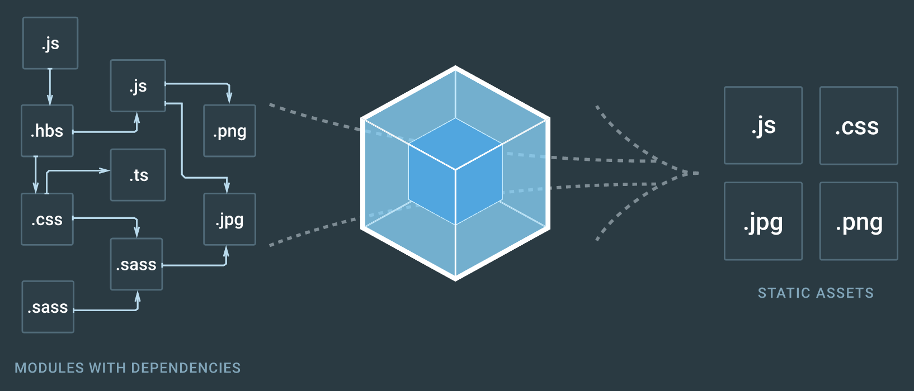
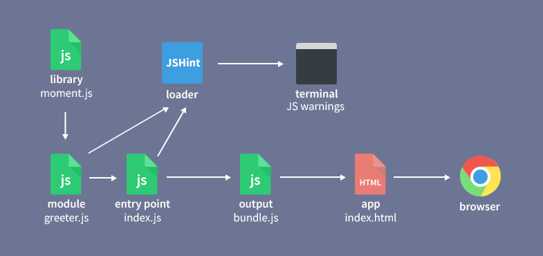
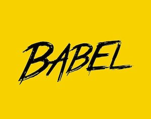

## Sesión 1: webpack

### 1. Pre-requisitos 
Antes de iniciar la sesión tu computadora debe de tener los siguientes programas instalados:
- Node.js
- npm
- git
- El editor de su preferencia

### 2. Objetivos :dart: 
- Repasar el uso de npm para instalar y manejar dependencias
- Utilizar webpack junto con conceptos básicos de ReactJS para generar aplicaciones web sencillas y dinámicas
- Manejar los estilos del sitio web mediante la lógica de la aplicación

### 3. Contenido :blue_book:

---

#### <ins>Node.js</ins>
 

Node.js fue ideado como un entorno de ejecución orientado a eventos y asíncrono de código abierto para el lenguaje de programación JavaScript. Está diseñado para crear aplicaciones web escalables.

Node.js es utilizado para el desarrollo de servicios web. Contrario a la mayoría del código de JavaScript, este no es ejecutado en u navegador sino en un servidor lo cual lo hace ideal para el desarrollo del backend de un sitio web.

---

#### <ins>npm</ins>
 

npm (Node package manager) como su nombre lo dice es el sistema gestor de paquetes para Node.js. Con npm se puede:

- Adaptar paquetes de código previamente desarrollado a nuestras aplicaciones, o incorporar paquetes tal cual están hechos.

- Instalar herramientas independientes para usarlas inmediatamente. 

- Ejecutar paquetes sin instalarlos usando npx, haciendo mas compactas nuestras aplicaciones.

- Compartir nuestro código con cualquier  desarrollador npm.

- Manejar las diferentes versiones de nuestras aplicaciones web.

- Actualizar los paquetes y dependencias de nuestro sistema de una forma rápida y sencilla.

---

#### <ins>webpack</ins>

Webpack es un compresor de módulos que nos ayuda a manejar los archivos de una aplicación web para convertirlo en un solo módulo que el navegador reconozca y sea capaz de interpretar, ptomando módulos con dependencias y generando activos estáticos que los representan conocidos como `bundle`. 

Fue originalmente desarrollado para JavaScript pero puede empaquetar cualquier archivo frontend de la aplicación como los son HTML, CSS, SCSS, imagens, gifs, etc.

Webpack toma las dependencias de los módulos y genera un grafo con éstas lo que permite que los desarrolladores un diseño modular de las aplicaciones.

Es necesario usar Node.js para poder utilizar webpack.

- [**`EJEMPLO 1`**](ejemplo-01/Readme.md)

---

#### <ins>Loaders</ins>

Un loader le dice a Webpack cómo pre-procesar y transformar el código de un módulo en concreto.

Puede transformar archivos de otros lenguajes a JavaScript y de esta forma garantizar que el navegador lo entienda, por ejemplo TypeScript.

Permite cargar archivos CSS directamente a los módulos de JavaScript, en especial cuando se trabaja con ReactJS nos permite inyectar estos estilos directamente al proyecto. 

Ademas permite cargar imágenes como urls, convirtiéndolas en una cadena y agregándola en linea directamente en el código.

Por omisión Webpack procesa archivos JavaScript y JSON, por lo que no es necesario instalar ningún loader especifico para eso. Sin embargo para cualquier otro formato de archivo si es necesario contar con un loader para convertirlos a módulos válidos que la aplicación sea capaz de interpretar.

- [**`EJEMPLO 2`**](ejemplo-02/Readme.md)
- [**`EJEMPLO 3`**](ejemplo-03/Readme.md)

---

#### <ins>Babel</ins>

Como cualquier lenguaje de programación JavaScript tiene también diferentes versión que varían entre ellas en diferentes aspectos. Resultaría muy complicado y poco eficiente que todos los navegadores fueran capaces de interpretar todas las versiones de JavasScript, este problema se soluciona con un estándar, es decir una versión que todos los navegadores entiendan. 

Esto se puede ver como una limitante a la hora de programar en JavaScript pues para cierta aplicación el desarrollador podría estar interesado en ciertos features de alguna de las versiones que no sea la estándar, aquí es cuando Babel entra en el juego. Babel es un traductor entre versiones de JavaScript, nos permite traducir código de nuevas versiones a una versión que el navegador o Node.js entiendan.

- [**`EJEMPLO 4`**](ejemplo-04/Readme.md)
- [**`EJEMPLO 5`**](ejemplo-04/Readme.md)

---

### 3. Actividad Final :hammer:

Aplica lo todo lo que aprendiste durante la sesión en esta actividad. 

- [**`Actividad Final sesión 1`**](actividad-final/Readme.md)
   

